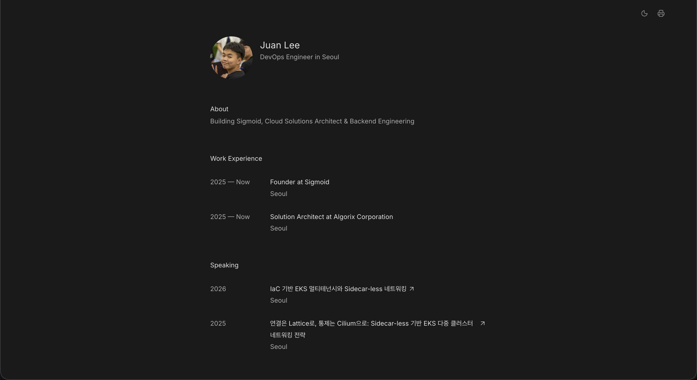

# Self-Hosted CV

> ReadCV-inspired, self-hosted CV/portfolio platform with a public profile, admin dashboard, media uploads, LinkedIn import, and Docker Compose deployment.

[한국어](#한국어) · [English](#english)

<p align="center">
    
</p>

---

## 한국어

Self-Hosted CV는 개발자, 창업자, 발표자, 크리에이터가 자신의 프로필과 이력을 직접 소유하고 운영할 수 있는 ReadCV 스타일 포트폴리오 플랫폼입니다. 공개 CV 페이지, 인증 기반 어드민, 이미지 업로드, 감사 로그, Redis 세션/캐시, MinIO 스토리지, Docker Compose 배포 구성을 포함합니다.

### 주요 기능

- ReadCV 스타일 공개 CV 페이지: 프로필, 소개, 경력, 글, 발표, 프로젝트, 학력, 연락처
- 어드민 대시보드: 전체 섹션 CRUD, 드래그 앤 드롭 정렬, 사이트 설정, 감사 로그 조회
- 미디어 업로드: MinIO presigned URL 기반 이미지 업로드와 orphan cleanup
- LinkedIn import: LinkedIn 데이터 아카이브 ZIP 업로드, 미리보기, 선택 반영
- 인증/보안: Redis 세션, CSRF 보호, Helmet, 로그인 throttling, 선택형 TOTP 2FA
- 성능/운영: Public CV Redis 캐싱, 자동 마이그레이션, health check, structured logging
- 사이트 설정: favicon, title, description, OG 이미지, analytics/custom script/css 관리
- 프린트/PDF: 브라우저 인쇄를 통한 깔끔한 라이트 테마 CV 출력
- CI/CD: GitHub Actions 기반 lint, test, build, audit, release workflow

### 기술 스택

- Monorepo: Yarn workspaces, Node.js 22+
- Web: React 19, React Router v7, Tailwind CSS v4, sonner, lucide-react
- Server: NestJS 11, Sequelize, PostgreSQL, Redis, MinIO, Speakeasy TOTP
- Infra: Docker Compose, Nginx, GitHub Actions, GHCR

### 원클릭 설치

```bash
curl -fsSL https://raw.githubusercontent.com/ninejuan/self-hosted-cv/main/install.sh | bash
```

Docker와 Git만 있으면 자동으로 클론, `.env` 생성, 빌드, 실행까지 완료됩니다. 설치 후 `http://서버IP`로 접속하세요.

자세한 배포 가이드: [docs/DEPLOYMENT.md](docs/DEPLOYMENT.md)

### 수동 설치: Docker Compose

```bash
cp .env.example .env
docker compose -f docker/docker-compose.yml up -d --build
```

실행 후 접속:

- 공개 사이트: `http://localhost`
- 어드민: `http://localhost/admin`
- 기본 계정: `.env`의 `ADMIN_USERNAME`, `ADMIN_PASSWORD`

프로덕션에서는 반드시 `.env`의 비밀번호, 세션 시크릿, MinIO 키를 안전한 값으로 변경하세요.

### 개발 환경 실행

```bash
yarn install
cp .env.example .env
docker compose -f docker/docker-compose.dev.yml up -d postgres redis minio
yarn dev:server
yarn dev:web
```

개발 서버 기본 주소:

- Web: `http://localhost:47173`
- API: `http://localhost:47300`
- PostgreSQL: `localhost:47532`
- Redis: `localhost:47379`
- MinIO: `http://localhost:47900`
- MinIO Console: `http://localhost:47901`

### 자주 쓰는 명령어

```bash
yarn test:server
yarn test:web
yarn build:server
yarn build:web
yarn lint
```

### 환경 변수

환경 변수는 `.env.example`을 기준으로 설정합니다. 핵심 값은 다음과 같습니다.

| 구분 | 변수 |
| --- | --- |
| App | `NODE_ENV`, `APP_PORT`, `APP_URL`, `APP_VERSION` |
| Auth | `ADMIN_USERNAME`, `ADMIN_PASSWORD`, `SESSION_SECRET`, `TOTP_ENCRYPTION_KEY` |
| Database | `POSTGRES_HOST`, `POSTGRES_PORT`, `POSTGRES_DB`, `POSTGRES_USER`, `POSTGRES_PASSWORD` |
| Redis | `REDIS_HOST`, `REDIS_PORT` |
| MinIO | `MINIO_INTERNAL_ENDPOINT`, `MINIO_PUBLIC_ENDPOINT`, `MINIO_ACCESS_KEY`, `MINIO_SECRET_KEY`, `MINIO_BUCKET` |
| Frontend/SSR | `VITE_API_URL`, `API_INTERNAL_URL`, `CORS_ORIGIN` |
| Update Check | `GITHUB_REPO`, `DISABLE_UPDATE_CHECK`, `UPDATE_CHECK_INTERVAL` |

전체 예시는 `.env.example`을 확인하세요.

### 운영 배포 메모

1. VPS 또는 서버에 Docker와 Docker Compose를 설치합니다.
2. 저장소를 clone하고 `.env`를 프로덕션 값으로 채웁니다.
3. `docker compose -f docker/docker-compose.yml up -d --build`로 스택을 시작합니다.
4. 기본 Compose는 Nginx를 `80` 포트로 노출합니다. TLS는 Caddy, Traefik, Cloudflare, 호스팅사 reverse proxy 등으로 앞단에서 처리하는 구성을 권장합니다.
5. PostgreSQL volume과 MinIO volume은 주기적으로 백업하세요.

마이그레이션은 서버 부팅 시 자동 실행됩니다. 운영 업그레이드 전에는 release note와 `.env.example` 변경 사항을 확인하세요.

---

## English

Self-Hosted CV is a ReadCV-inspired portfolio platform for people who want to own their professional profile. It includes a public CV page, authenticated admin dashboard, media uploads, audit logs, Redis-backed sessions and caching, MinIO object storage, and Docker Compose deployment assets.

### Features

- ReadCV-style public CV page: profile, about, work experience, writing, speaking, projects, education, and contacts
- Admin dashboard: full-section CRUD, drag-and-drop ordering, site settings, and audit log viewer
- Media uploads: MinIO presigned URL flow with orphan cleanup
- LinkedIn import: upload a LinkedIn archive ZIP, preview detected records, and apply selected data
- Auth/security: Redis sessions, CSRF protection, Helmet, login throttling, and optional TOTP 2FA
- Operations: Redis caching for the public CV, automatic migrations, health checks, and structured logging
- Site settings: favicon, title, description, OG image, analytics/custom script/css management
- Print/PDF: clean light-theme CV output through the browser print dialog
- CI/CD: GitHub Actions workflows for linting, tests, builds, audits, and releases

### Tech Stack

- Monorepo: Yarn workspaces, Node.js 22+
- Web: React 19, React Router v7, Tailwind CSS v4, sonner, lucide-react
- Server: NestJS 11, Sequelize, PostgreSQL, Redis, MinIO, Speakeasy TOTP
- Infra: Docker Compose, Nginx, GitHub Actions, GHCR

### One-Click Install

```bash
curl -fsSL https://raw.githubusercontent.com/ninejuan/self-hosted-cv/main/install.sh | bash
```

Requires only Docker and Git. The script clones the repo, generates a secure `.env`, builds, and starts everything. Open `http://your-server-ip` when done.

Full deployment guide: [docs/DEPLOYMENT.md](docs/DEPLOYMENT.md)

### Manual Install: Docker Compose

```bash
cp .env.example .env
docker compose -f docker/docker-compose.yml up -d --build
```

Then open:

- Public site: `http://localhost`
- Admin: `http://localhost/admin`
- Default credentials: `ADMIN_USERNAME` and `ADMIN_PASSWORD` from `.env`

For production, replace the default password, session secret, and MinIO credentials with secure values before exposing the service.

### Development Setup

```bash
yarn install
cp .env.example .env
docker compose -f docker/docker-compose.dev.yml up -d postgres redis minio
yarn dev:server
yarn dev:web
```

Default development endpoints:

- Web: `http://localhost:47173`
- API: `http://localhost:47300`
- PostgreSQL: `localhost:47532`
- Redis: `localhost:47379`
- MinIO: `http://localhost:47900`
- MinIO Console: `http://localhost:47901`

### Useful Commands

```bash
yarn test:server
yarn test:web
yarn build:server
yarn build:web
yarn lint
```

### Environment Variables

Use `.env.example` as the source of truth. Important variables include:

| Area | Variables |
| --- | --- |
| App | `NODE_ENV`, `APP_PORT`, `APP_URL`, `APP_VERSION` |
| Auth | `ADMIN_USERNAME`, `ADMIN_PASSWORD`, `SESSION_SECRET`, `TOTP_ENCRYPTION_KEY` |
| Database | `POSTGRES_HOST`, `POSTGRES_PORT`, `POSTGRES_DB`, `POSTGRES_USER`, `POSTGRES_PASSWORD` |
| Redis | `REDIS_HOST`, `REDIS_PORT` |
| MinIO | `MINIO_INTERNAL_ENDPOINT`, `MINIO_PUBLIC_ENDPOINT`, `MINIO_ACCESS_KEY`, `MINIO_SECRET_KEY`, `MINIO_BUCKET` |
| Frontend/SSR | `VITE_API_URL`, `API_INTERNAL_URL`, `CORS_ORIGIN` |
| Update Check | `GITHUB_REPO`, `DISABLE_UPDATE_CHECK`, `UPDATE_CHECK_INTERVAL` |

See `.env.example` for the full list and defaults.

### Deployment Notes

1. Install Docker and Docker Compose on your VPS or server.
2. Clone the repository and create a production `.env`.
3. Start the stack with `docker compose -f docker/docker-compose.yml up -d --build`.
4. The default Compose stack exposes Nginx on port `80`. Put TLS in front with Caddy, Traefik, Cloudflare, or a host-managed reverse proxy.
5. Back up PostgreSQL and MinIO volumes regularly.

Database migrations run automatically during server bootstrap. Before upgrading production, review release notes and changes in `.env.example`.

## License

Apache License 2.0 — see [LICENSE](LICENSE) for details.
